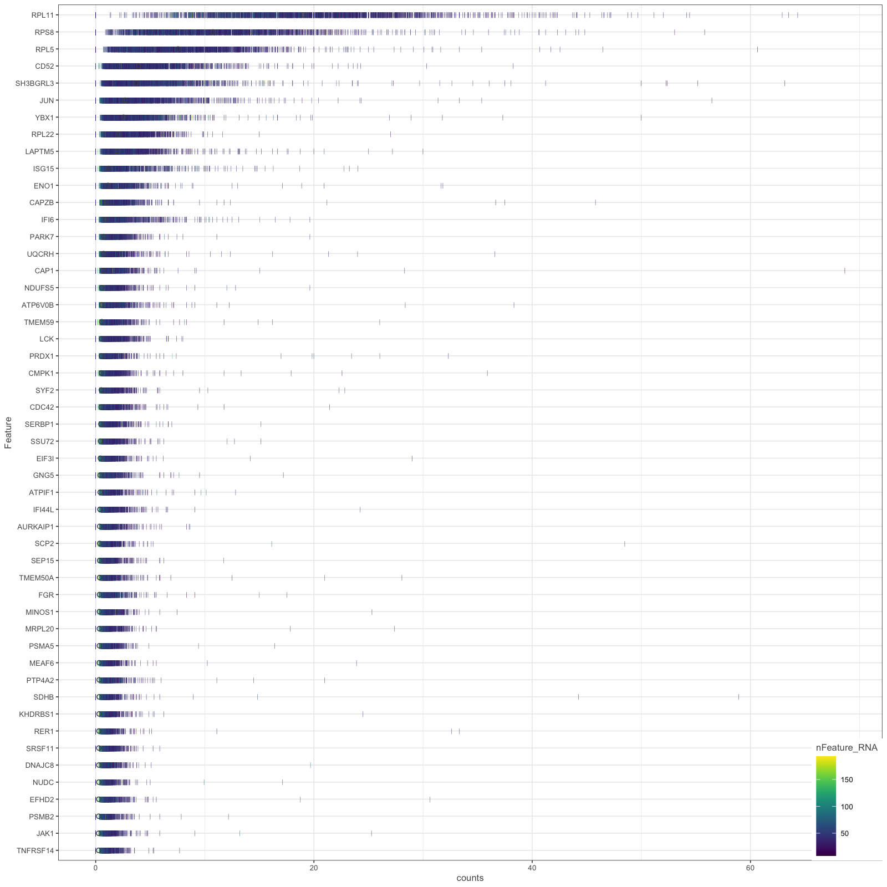
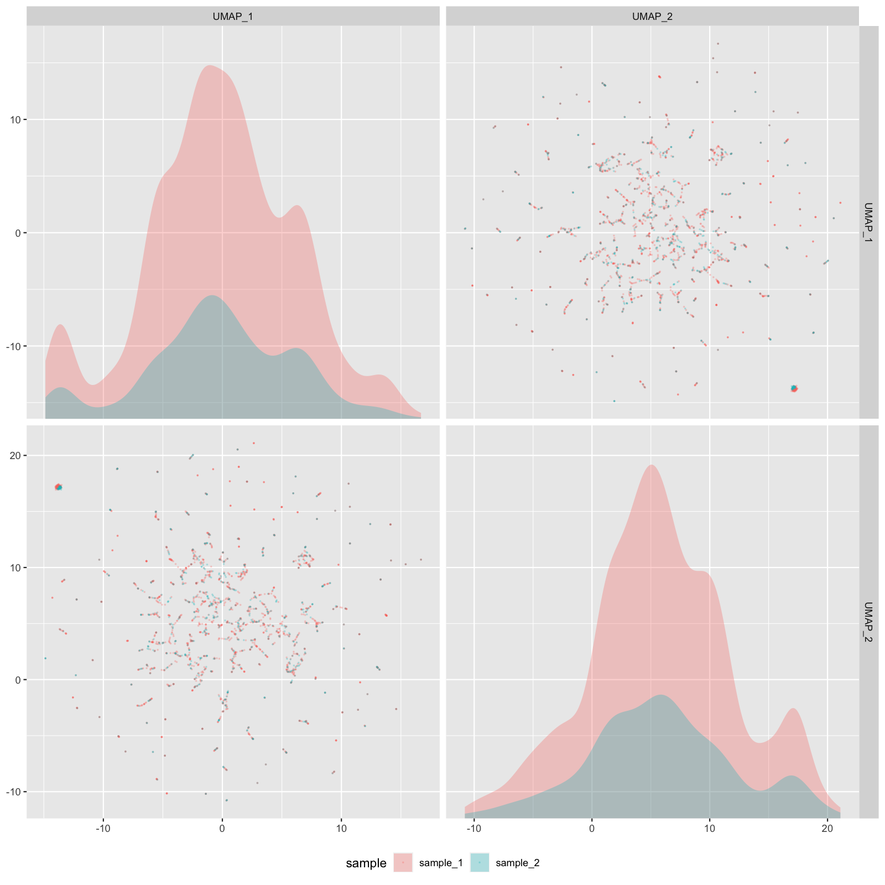

<p align="center"></p>

&nbsp;&nbsp;&nbsp;&nbsp;&nbsp;&nbsp;&nbsp;&nbsp;&nbsp;&nbsp;&nbsp;&nbsp;&nbsp;&nbsp;&nbsp;&nbsp;&nbsp;&nbsp;&nbsp;&nbsp;&nbsp;&nbsp;&nbsp;&nbsp;&nbsp;&nbsp;&nbsp;&nbsp;


[](https://github.com/python/black)
[](https://github.com/TheAustinator/cellforest/issues)
[](https://travis-ci.org/TheAustinator/cellforest)
<!--[](https://badge.fury.io/py/cellforest)-->


## A simple, interactive, and customizable single cell workflow manager
<p align="center">
  <a href="#core concepts">Core Concepts</a> •
  <a href="#overview">Overview</a> •
  <a href="#features">Features</a> •
  <a href="#usage">Usage</a> •
  <a href="#upcoming-features">Upcoming Features</a> •
  <a href="#quality-control-plotting">Quality Control Plotting</a>
</p>


## Core Concepts


### Features

## Usage
**Install**
```python
pip install cellforest
```
**Install Accompanying R Package**
```bash
git clone https://github.com/TheAustinator/cellforest.git
R -e "install.packages('cellforest/cellforestR', repos=NULL, type='source')"
```
**Import**
```python
from cellforest import CellBranch
```

### Examples

## Upcoming Features

## Quality Control Plotting
Following the paradigm of tree of parameters, Cellforest implements automated generation of quality control (QC) plots after each process run. This means that a user can retroactively look up preliminary analyses, such as how the cells clustered, without having to run and re-run the pipeline on different parameters. Compared to ad hoc parameters picking (reactive) QC plots implementation pre-defines all plots on a wide range of parameters (proactive) which leads to drastic time savings for analyses requiring constant iteration of upstream parameters.
### I. Example plots
Here is a pick of plots commonly used for scRNA-Seq, already implemented in Cellforest. For a full list, check out [III. All implemented plots](cellforest/README.md#iii-all-implemented-plots).
| Plot example                                                 | Plot definition and method                                   | Description                                                  | Use case                                                     | Available and suggested `plot_kwargs`                        |
| ------------------------------------------------------------ | ------------------------------------------------------------ | ------------------------------------------------------------ | ------------------------------------------------------------ | ------------------------------------------------------------ |
|  | Plot config name: `_UMIS_VS_GENES_SCAT_`<br /><br />Method (use at or after `normalize`): `plot_umis_vs_genes_scat()` | Scatter plot showing relationship between UMI and gene counts per cell. | Filter out damaged cells: based on low UMI, gene count and/or low UMI, moderate gene count (high mitochonrial genes percentage). | <pre lang="yaml">stratify:<br/>  - none<br/>  - sample_id<br/>plot_size: [800, 800]<br/>alpha: 0.4<br/></pre>All keyword arguments for [pyplot.scatter()](https://matplotlib.org/3.3.2/api/_as_gen/matplotlib.pyplot.scatter.html) |
|  | Plot config name: `_HIGHEST_EXPRS_DENS_`<br /><br />Method (use at or after `normalize`): `plot_highest_exprs_dens()` | Dense plots showing distribution of UMI counts per cell in 50 highest expressing genes. | Determine main expressing genes to ensure that cells are filtered correctly and there are not many dead cells (e.g., mito genes as top expression genes) influencing the analysis. | <pre lang="yaml">stratify:<br/>  - none<br/>  - sample_id<br/>plot_size: [1600, 1600]<br/></pre>   |
|  | Plot config name: `_UMAP_EMBEDDINGS_SCAT_`<br /><br />Method (use at or after `reduce`): `plot_umap_embeddings_scat()` | Facet plot showing relationship between principal components in UMAP. | Examine sources of variance (donor-donor, lane-lane, timing, sample_id, etc.) and identify batch effects. | <pre lang="yaml">stratify:<br/>  - none<br/>  - sample_id<br/>  - nFeature_RNA<br />plot_size: [1600, 1600]<br/>npcs: 2  # number of facets per dimension<br />alpha: 0.4</pre> |
|  | Plot config name: `_PERC_RIBO_PER_CELL_VLN_`<br /><br />Method (used at `cluster`): `plot_perc_ribo_per_cell_vln()` | Violin plots showing distribution of ribosomal genes percentages per cell, stratified by cluster. |                                                              | <pre lang="yaml">stratify: cluster<br/>plot_size: [1600, 800]<br/></pre> |

<table border="0" class="dataframe">
  <thead>
    <tr style="text-align: right;">
      <th rowspan="2" width="20%">Plot definition and method</th>
      <th rowspan="2" width="30%">Description</th>
      <th rowspan="2" width="30%">Use case</th>
      <th rowspan="2">Available and suggested <code>plot_kwargs</code></th>
    </tr>
  </thead>
  <tbody>
    <tr>
      <td><br/>Plot config name: <code>_UMIS_VS_GENES_SCAT_</code><br/>Method (use at or after "normalize"): <code>`plot_umis_vs_genes_scat()</code></td>
      <td>Scatter plot showing relationship between UMI and gene counts per cell.</td>
      <td>Generally there should be a good correlation. Filter out damaged cells: based on low UMI, gene count and/or low UMI, moderate gene count (high mitochonrial genes percentage).</td>
      <td><pre lang="yaml">
stratify:
  - none
  - sample_id
plot_size: [800, 800]
bins: 50
alpha: 0.4
      </pre><br />All keyword arguments for <a href="https://matplotlib.org/3.3.2/api/_as_gen/matplotlib.pyplot.scatter.html">pyplot.scatter()</a></td>
    </tr>
    <tr>
      <td><br/>Plot config name: <code>_HIGHEST_EXPRS_DENS_</code><br/>Method (use at or after "normalize"): <code>plot_highest_exprs_dens()</code></td>
      <td>Dense plots showing distribution of UMI counts per cell in 50 highest expressing genes.</td>
      <td>Determine main expressing genes to ensure that cells are filtered correctly and there are not many dead cells (e.g., mito genes as top expression genes) influencing the analysis.</td>
      <td><pre lang="yaml">
stratify:
  - none
  - sample_id
plot_size: [1600, 1600]
      </pre></td>
    </tr>
    <tr>
      <td><br/>Plot config name: <code>_UMAP_EMBEDDINGS_SCAT_</code><br/>Method (use at or after "reduce"): <code>plot_umap_embeddings_scat()</code></td>
      <td>Facet plot showing relationship between principal components in UMAP.</td>
      <td>Examine sources of variance (donor-donor, lane-lane, timing, sample, etc.) and identify batch effects.</td>
      <td><pre lang="yaml">
stratify:
  - none
  - sample_id
  - nFeature_RNA
plot_size: [1600, 1600]
alpha: 0.4
npcs: 2
      </pre></td>
    </tr>
    <tr>
      <td><br/>Plot config name: <code>_PERC_RIBO_PER_CELL_VLN_</code><br/>Method (use at or after "cluster") <code>plot_perc_ribo_per_cell_vln()</code></td>
      <td>Violin plots showing distribution of ribosomal genes percentages per cell, stratified by cluster.</td>
      <td>TODO-QC: FILL IN HERE.</td>
      <td><pre lang="yaml">
stratify: cluster
plot_size: [1600, 800]
      </pre></td>
    </tr>
  </tbody>
</table>

### II. Quick specification
Plots declaration can done before the tree is run or after, with forcing generation of not-yet-created plots. Analogous to process run outputs, all plots are stored in `_plots`, inside the folders for corresponding process outputs. Now, we shall look at an example configuration for QC plotting:
```yaml
plot_map:
  root:
    _UMIS_PER_BARCODE_RANK_CURV_: ~
  normalize:
    _GENES_PER_CELL_HIST_:
      plot_kwargs:
        stratify: 
          - sample_id
          - none
        plot_size: [800, 800]
```
1. This piece shall be located in `default_config.yaml` along with process specifications. 2nd level keys (`root`, `normalize`) indicate definition of plots at the corresponding process alias/name
2. Plot names are in the format of `_<PLOT_NAME>_<PLOT_TYPE>_`, for the full list of available plot names, refer to INSERT_LINK.
3. For each plot we can specify parameters. For example, `stratify` groups the cells by a specified column in the metadata. In this case, there will be two plots created: first stratified by `sample_id` ID with generated plot size of 800x800 pixels and second plot on all data (no stratification) with size 800x800 pixels.
4. As soon as you initialize a branch (`branch = cellforest.from_sample_metadata(root_dir, meta, branch_spec=branch_spec)`) or run a process (e.g., `branch.process.normalize()`), specified plots will be generated immediately after process finishes running.
5. For advanced plotting specifications, refer to INSERT_LINK.

