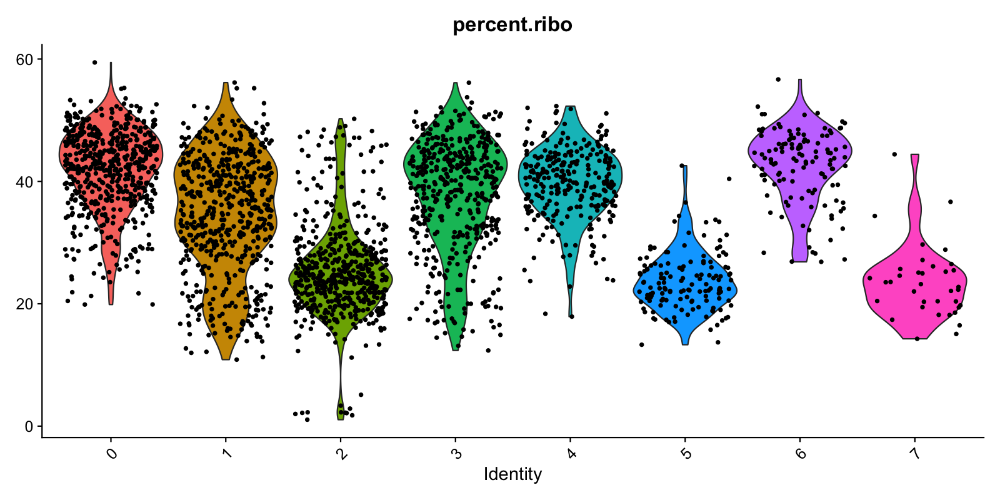

<p align="center"></p>

&nbsp;&nbsp;&nbsp;&nbsp;&nbsp;&nbsp;&nbsp;&nbsp;&nbsp;&nbsp;&nbsp;&nbsp;&nbsp;&nbsp;&nbsp;&nbsp;&nbsp;&nbsp;&nbsp;&nbsp;&nbsp;&nbsp;&nbsp;&nbsp;&nbsp;&nbsp;&nbsp;&nbsp;


[](https://github.com/python/black)
[](https://github.com/TheAustinator/cellforest/issues)
[](https://travis-ci.org/TheAustinator/cellforest)
<!--[](https://badge.fury.io/py/cellforest)-->


## A simple, interactive, and customizable single cell workflow manager
<p align="center">
  <a href="#core concepts">Core Concepts</a> •
  <a href="#overview">Overview</a> •
  <a href="#features">Features</a> •
  <a href="#usage">Usage</a> •
  <a href="#upcoming-features">Upcoming Features</a> •
  <a href="#quality-control-plotting">Quality Control Plotting</a>
</p>


## Core Concepts


### Features

## Usage
**Install**
```python
pip install cellforest
```
**Install Accompanying R Package**
```bash
git clone https://github.com/TheAustinator/cellforest.git
R -e "install.packages('cellforest/cellforestR', repos=NULL, type='source')"
```
**Import**
```python
from cellforest import CellBranch
```

### Examples

## Upcoming Features

## Quality Control Plotting
Following the paradigm of tree of parameters, Cellforest implements automated generation of quality control (QC) plots after each process run. This means that a user can retroactively look up preliminary analyses, such as how the cells clustered, without having to run and re-run the pipeline on different parameters. Compared to ad hoc parameters picking (reactive) QC plots implementation pre-defines all plots on a wide range of parameters (proactive) which leads to drastic time savings for analyses requiring constant iteration of upstream parameters.
### I. Example plots
Here is a pick of plots commonly used for scRNA-Seq, already implemented in Cellforest. For a full list, check out INSERT_LINK.
| Plot example                                                 | Plot definition and method                                   | Description                                                  | Use case                                                     | Available and suggested `plot_kwargs`                        |
| ------------------------------------------------------------ | ------------------------------------------------------------ | ------------------------------------------------------------ | ------------------------------------------------------------ | ------------------------------------------------------------ |
|  | Plot config name: `_UMIS_VS_GENES_SCAT_`<br /><br />Method (use at or after `normalize`): `plot_umis_vs_genes_scat()` | Scatter plot showing relationship between UMI and gene counts per cell. | Filter out damaged cells: based on low UMI, gene count and/or low UMI, moderate gene count (high mitochonrial genes percentage). | <code lang="yaml">stratify:<br/>  - none<br/>  - sample_id<br/>plot_size: [800, 800]<br/>alpha: 0.4<br/></code>All keyword arguments for [pyplot.scatter()](https://matplotlib.org/3.3.2/api/_as_gen/matplotlib.pyplot.scatter.html) |
|  | Plot config name: `_HIGHEST_EXPRS_DENS_`<br /><br />Method (use at or after `normalize`): `plot_highest_exprs_dens()` | Dense plots showing distribution of UMI counts per cell in 50 highest expressing genes. | Determine main expressing genes to ensure that cells are filtered correctly and there are not many dead cells (e.g., mito genes as top expression genes) influencing the analysis. | <pre lang="yaml">stratify:<br/>  - none<br/>  - sample_id<br/>plot_size: [1600, 1600]<br/></pre>   |
|  | Plot config name: `_UMAP_EMBEDDINGS_SCAT_`<br /><br />Method (use at or after `reduce`): `plot_umap_embeddings_scat()` | Facet plot showing relationship between principal components in UMAP. | Examine sources of variance (donor-donor, lane-lane, timing, sample_id, etc.) and identify batch effects. | <pre lang="yaml">stratify:<br/>  - none<br/>  - sample_id<br/>  - nFeature_RNA<br />plot_size: [1600, 1600]<br/>npcs: 2  # number of facets per dimension<br />alpha: 0.4</pre> |
|  | Plot config name: `_PERC_RIBO_PER_CELL_VLN_`<br /><br />Method (used at `cluster`): `plot_perc_ribo_per_cell_vln()` | Violin plots showing distribution of ribosomal genes percentages per cell, stratified by cluster. |                                                              | <pre lang="yaml">stratify: cluster<br/>plot_size: [1600, 800]<br/></pre> |
### II. Quick specification
Plots declaration can done before the tree is run or after, with forcing generation of not-yet-created plots. Analogous to process run outputs, all plots are stored in `_plots`, inside the folders for corresponding process outputs. Now, we shall look at an example configuration for QC plotting:
```yaml
plot_map:
  root:
    _UMIS_PER_BARCODE_RANK_CURV_: ~
  normalize:
    _GENES_PER_CELL_HIST_:
      plot_kwargs:
        stratify: 
          - sample_id
          - none
        plot_size: [800, 800]
```
1. This piece shall be located in `default_config.yaml` along with process specifications. 2nd level keys (`root`, `normalize`) indicate definition of plots at the corresponding process alias/name
2. Plot names are in the format of `_<PLOT_NAME>_<PLOT_TYPE>_`, for the full list of available plot names, refer to INSERT_LINK.
3. For each plot we can specify parameters. For example, `stratify` groups the cells by a specified column in the metadata. In this case, there will be two plots created: first stratified by `sample_id` ID with generated plot size of 800x800 pixels and second plot on all data (no stratification) with size 800x800 pixels.
4. As soon as you initialize a branch (`branch = cellforest.from_sample_metadata(root_dir, meta, branch_spec=branch_spec)`) or run a process (e.g., `branch.process.normalize()`), specified plots will be generated immediately after process finishes running.
5. For advanced plotting specifications, refer to INSERT_LINK.

<table border="1" class="dataframe">
  <thead>
    <tr style="text-align: right;">
      <th rowspan="2">Model</th>
      <th rowspan="2">Valid (↑)</th>
      <th rowspan="2">Unique@1k (↑)</th>
      <th rowspan="2">Unique@10k (↑)</th>
      <th colspan="2">FCD (↓)</th>
      <th colspan="2">SNN (↑)</th>
      <th colspan="2">Frag (↑)</th>
      <th colspan="2">Scaf (↑)</th>
      <th rowspan="2">IntDiv (↑)</th>
      <th rowspan="2">IntDiv2 (↑)</th>
      <th rowspan="2">Filters (↑)</th>
      <th rowspan="2">Novelty (↑)</th>
    </tr>
    <tr>
      <th>Test</th>
      <th>TestSF</th>
      <th>Test</th>
      <th>TestSF</th>
      <th>Test</th>
      <th>TestSF</th>
      <th>Test</th>
      <th>TestSF</th>
    </tr>
  </thead>
  <tbody>
    <tr>
      <td></td>
      <td><pre lang="yaml">
        stratify:
          - none
          - sample_id
        plot_size: [800, 800]
        alpha: 0.4
      </pre></td>
      <td><i>1.0</i></td>
      <td><i>1.0</i></td>
      <td><i>0.008</i></td>
      <td><i>0.4755</i></td>
      <td><i>0.6419</i></td>
      <td><i>0.5859</i></td>
      <td><i>1.0</i></td>
      <td><i>0.9986</i></td>
      <td><i>0.9907</i></td>
      <td><i>0.0</i></td>
      <td><i>0.8567</i></td>
      <td><i>0.8508</i></td>
      <td><i>1.0</i></td>
      <td><i>1.0</i></td>
    </tr>
    <tr>
      <td>HMM</td>
      <td>0.076±0.0322</td>
      <td>0.623±0.1224</td>
      <td>0.5671±0.1424</td>
      <td>24.4661±2.5251</td>
      <td>25.4312±2.5599</td>
      <td>0.3876±0.0107</td>
      <td>0.3795±0.0107</td>
      <td>0.5754±0.1224</td>
      <td>0.5681±0.1218</td>
      <td>0.2065±0.0481</td>
      <td>0.049±0.018</td>
      <td>0.8466±0.0403</td>
      <td>0.8104±0.0507</td>
      <td>0.9024±0.0489</td>
      <td><b>0.9994±0.001</b></td>
    </tr>
    <tr>
      <td>NGram</td>
      <td>0.2376±0.0025</td>
      <td>0.974±0.0108</td>
      <td>0.9217±0.0019</td>
      <td>5.5069±0.1027</td>
      <td>6.2306±0.0966</td>
      <td>0.5209±0.001</td>
      <td>0.4997±0.0005</td>
      <td>0.9846±0.0012</td>
      <td>0.9815±0.0012</td>
      <td>0.5302±0.0163</td>
      <td>0.0977±0.0142</td>
      <td><b>0.8738±0.0002</b></td>
      <td>0.8644±0.0002</td>
      <td>0.9582±0.001</td>
      <td>0.9694±0.001</td>
    </tr>
    <tr>
      <td>Combinatorial</td>
      <td><b>1.0±0.0</b></td>
      <td>0.9983±0.0015</td>
      <td>0.9909±0.0009</td>
      <td>4.2375±0.037</td>
      <td>4.5113±0.0274</td>
      <td>0.4514±0.0003</td>
      <td>0.4388±0.0002</td>
      <td>0.9912±0.0004</td>
      <td>0.9904±0.0003</td>
      <td>0.4445±0.0056</td>
      <td>0.0865±0.0027</td>
      <td>0.8732±0.0002</td>
      <td><b>0.8666±0.0002</b></td>
      <td>0.9557±0.0018</td>
      <td>0.9878±0.0008</td>
    </tr>
    <tr>
      <td>CharRNN</td>
      <td>0.9748±0.0264</td>
      <td><b>1.0±0.0</b></td>
      <td><b>0.9994±0.0003</b></td>
      <td><b>0.0732±0.0247</b></td>
      <td><b>0.5204±0.0379</b></td>
      <td>0.6015±0.0206</td>
      <td>0.5649±0.0142</td>
      <td><b>0.9998±0.0002</b></td>
      <td>0.9983±0.0003</td>
      <td>0.9242±0.0058</td>
      <td><b>0.1101±0.0081</b></td>
      <td>0.8562±0.0005</td>
      <td>0.8503±0.0005</td>
      <td>0.9943±0.0034</td>
      <td>0.8419±0.0509</td>
    </tr>
    <tr>
      <td>AAE</td>
      <td>0.9368±0.0341</td>
      <td><b>1.0±0.0</b></td>
      <td>0.9973±0.002</td>
      <td>0.5555±0.2033</td>
      <td>1.0572±0.2375</td>
      <td>0.6081±0.0043</td>
      <td>0.5677±0.0045</td>
      <td>0.991±0.0051</td>
      <td>0.9905±0.0039</td>
      <td>0.9022±0.0375</td>
      <td>0.0789±0.009</td>
      <td>0.8557±0.0031</td>
      <td>0.8499±0.003</td>
      <td>0.996±0.0006</td>
      <td>0.7931±0.0285</td>
    </tr>
    <tr>
      <td>VAE</td>
      <td>0.9767±0.0012</td>
      <td><b>1.0±0.0</b></td>
      <td>0.9984±0.0005</td>
      <td>0.099±0.0125</td>
      <td>0.567±0.0338</td>
      <td><b>0.6257±0.0005</b></td>
      <td><b>0.5783±0.0008</b></td>
      <td>0.9994±0.0001</td>
      <td><b>0.9984±0.0003</b></td>
      <td><b>0.9386±0.0021</b></td>
      <td>0.0588±0.0095</td>
      <td>0.8558±0.0004</td>
      <td>0.8498±0.0004</td>
      <td><b>0.997±0.0002</b></td>
      <td>0.6949±0.0069</td>
    </tr>
    <tr>
      <td>JTN-VAE</td>
      <td><b>1.0</b></td>
      <td><b>1.0</b></td>
      <td>0.9992</td>
      <td>0.4224</td>
      <td>0.9962</td>
      <td>0.5561</td>
      <td>0.5273</td>
      <td>0.9962</td>
      <td>0.9948</td>
      <td>0.8925</td>
      <td>0.1005</td>
      <td>0.8512</td>
      <td>0.8453</td>
      <td>0.9778</td>
      <td>0.9153</td>
    </tr>
    <tr>
      <td>LatentGAN</td>
      <td>0.8966±0.0029</td>
      <td><b>1.0±0.0</b></td>
      <td>0.9968±0.0002</td>
      <td>0.2968±0.0087</td>
      <td>0.8281±0.0117</td>
      <td>0.5371±0.0004</td>
      <td>0.5132±0.0002</td>
      <td>0.9986±0.0004</td>
      <td>0.9972±0.0007</td>
      <td>0.8867±0.0009</td>
      <td>0.1072±0.0098</td>
      <td>0.8565±0.0007</td>
      <td>0.8505±0.0006</td>
      <td>0.9735±0.0006</td>
      <td>0.9498±0.0006</td>
    </tr>
  </tbody>
</table>