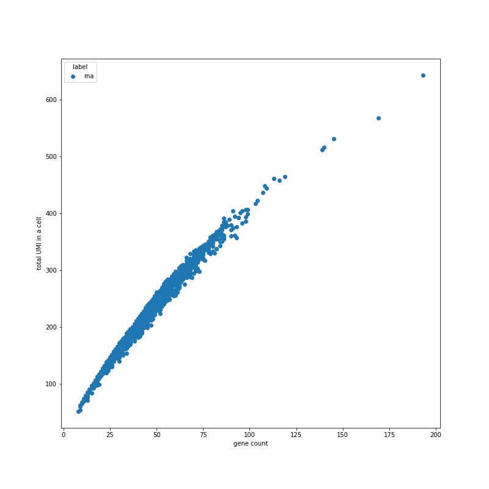
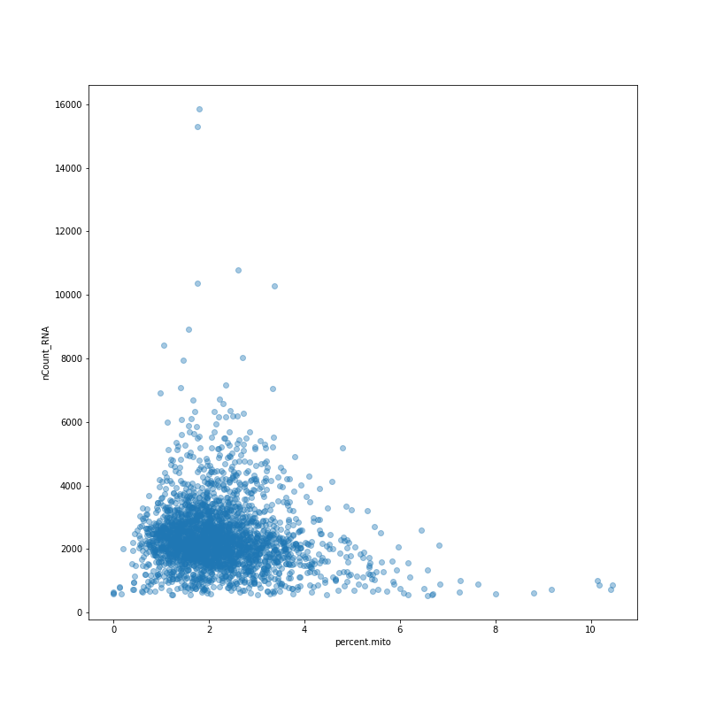
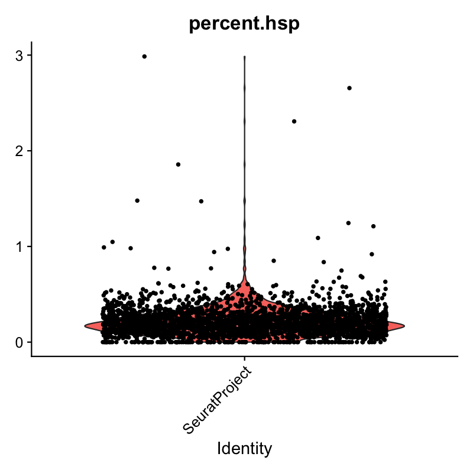
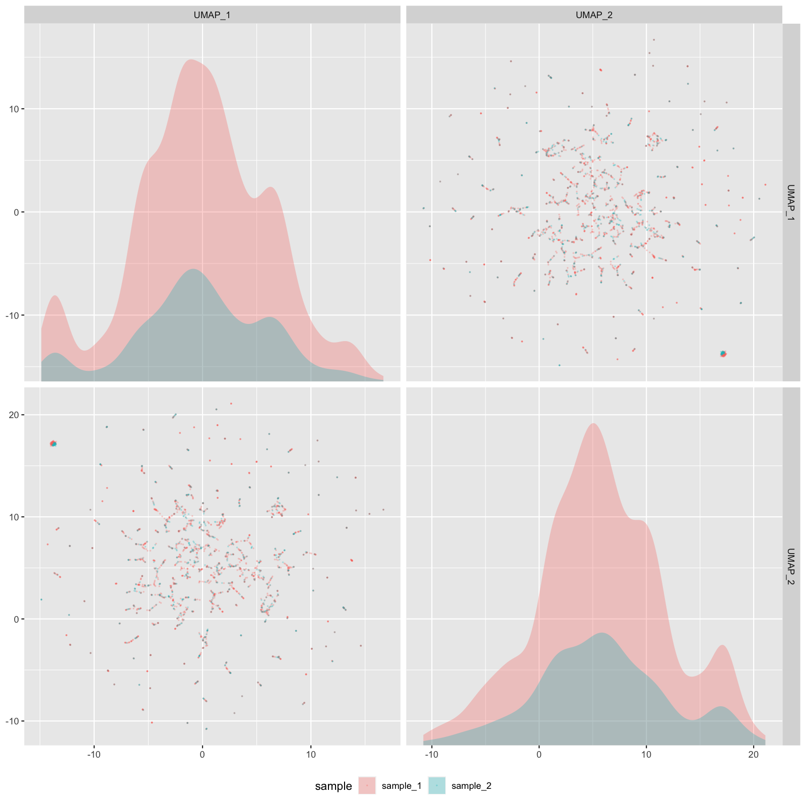
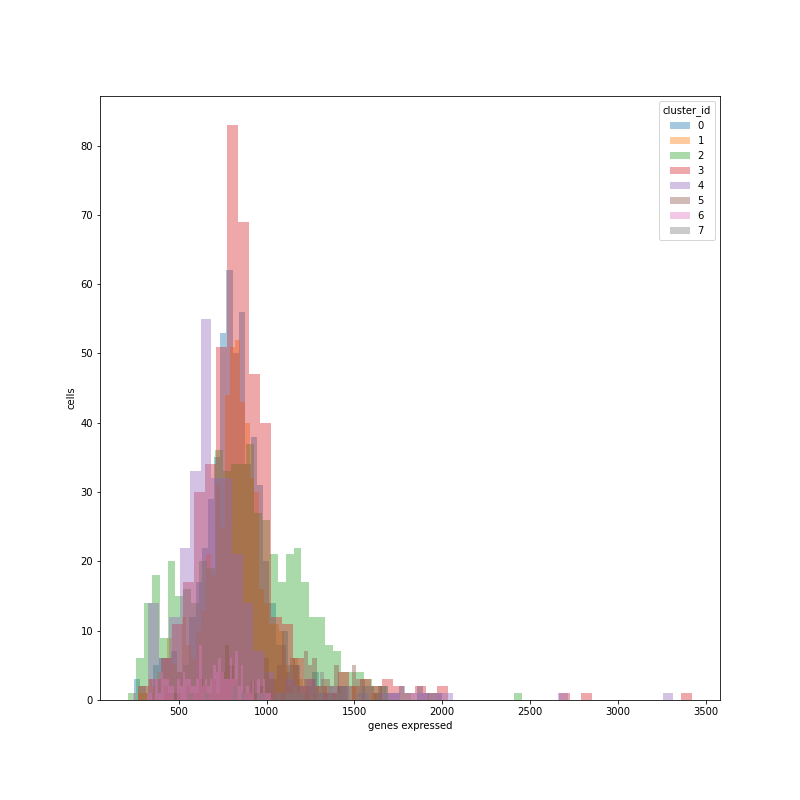
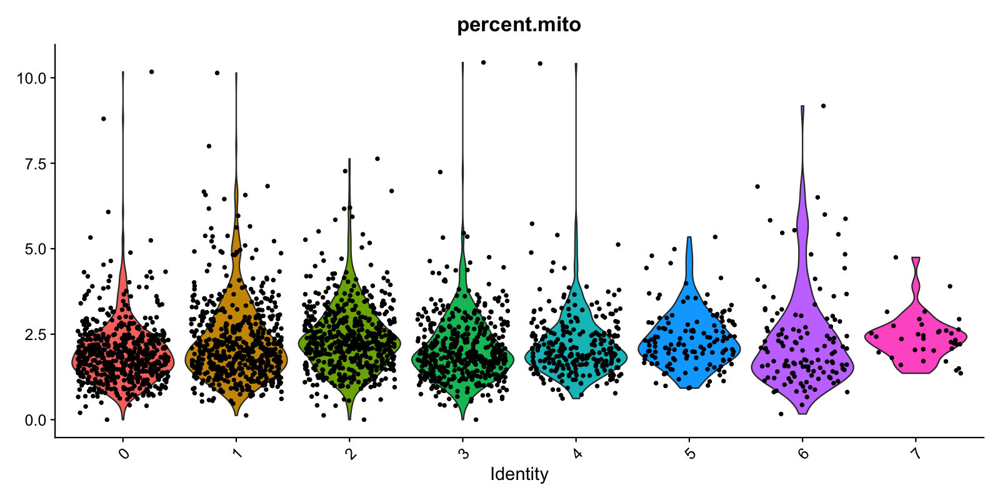
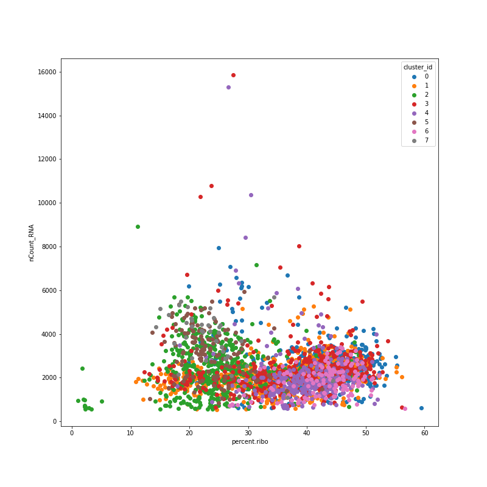
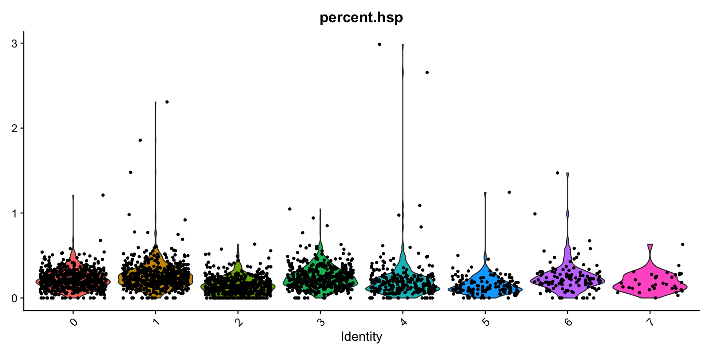

# Cellforest Processes
## Table of Content
- [Automated Quality Control (QC) Plotting](#automated-quality-control--qc--plotting)
  * [I. Setting up QC plotting](#i-setting-up-qc-plotting)
  * [II. Parametrizing QC plots](#ii-parametrizing-qc-plots)
  * [III. All implemented plots](#iii-all-implemented-plots)
  * [IV. Adding new or modifying existing QC plots](#iv-adding-new-or-modifying-existing-qc-plots)
## Automated Quality Control (QC) Plotting 

### I. Setting up QC plotting

1. All plots are defined in `plot_map` dictionary in the config file (`cellforest/config/default_config.yaml`)

2. A typical `plot_map` dictionary looks like this in a config file:

   ```yaml
   plot_map:
     root:
       _UMIS_PER_CELL_HIST_: ~
       _UMIS_PER_BARCODE_RANK_CURV_: ~
     normalize:
       _GENES_PER_CELL_HIST_:
         plot_method: plot_umis_per_cell_hist
         filename: gene_per_cell_hist
       _UMIS_PER_CELL_HIST_: ~
   ```

   1. At the top level, process name is defined (e.g., `root`, `normalize`, `cluster`) — these would indicate definition of plots per process run
   2. Inside each key is a dictionary of plot names. The format used in CellForest is all-caps bound with underscores (e.g., `_THIS_IS_A_PLOT_NAME_`)
   3. For each plot, you can define `plot_method` or `filename`. `plot_method` will be scraped from scripts in `cellforest/plot` and map to the plotting function
   4. `filename` refers to the name of the image that will be saved upon running the plotting function. Note that you can omit the extension for the filename but you can also include it to force a specific extension for each plot
   5. You can use `~` as value for a plot key to indicate usage of default parameters (we will talk about parametrization in the next section), such as inferred filename (`_THIS_IS_A_PLOT_NAME_` becomes `this_is_plot_name`) as well as inferred plot method (`_THIS_IS_A_PLOT_NAME_` becomes `plot_this_is_a_plot_name()`)

3. Plots are run with the help of the `hook_generate_plots` hook in the config file. Basing from the `plot_map`, after a process successfully runs (e.g., after `branch.process.normalize()`), mapped plotting functions will be triggered

### II. Parametrizing QC plots

1. To parametrize plots as well as the plotting methods that produce the plots, we can use the `plot_kwargs` field in each plot along with the required `plot_kwargs_defaults` in the config

2. Here is an example in a config file:

   ```yaml
   plot_kwargs_defaults:
     stratify:
       default: None
     plot_size:  # width x height in px
       default: [800, 800]
       large: [1600, 1600]
     filename_ext: png
     
   plot_map:
     normalize:
       _GENES_PER_CELL_HIST_:
         plot_kwargs:
           stratify: 
             - sample_id
             - default
           plot_size: large
   ```

   1. `plot_kwargs_defaults` defines the named values for each keyword argument option (e.g., `plot_size["default"] == [800, 800]`); for each keyword argument, there must a `default` option because this will be used for filename inference (we will talk about it in a bit)

   2. Keyword arguments in individual plots will try to seek for the value in `plot_kwargs_defaults` and if found, will use that value to pass on to the plotting function. If not, the noted value is passed on. For example, in the above case, `default` will map to `None` whereas `sample_id` will just pass on as `sample_id`

   3. **Important rule**: “same length or length 1.” In the above case, `stratify` has 2 defined options (is a list of 2 elements) so CellForest will infer that for each of those stratification options, the plot size will be large (`[1600, 1600]`).

   4. If we want to have one of them large, one of them default, we can write in the same order:

      ```yaml
      stratify: 
        - sample_id
        - default
      plot_size:
        - large
        - default
      ```

      **Note**: it will not work if you try to match keyword arguments of different lengths (e.g., 2 and 3) because there will not be a 1-to-1 mapping of arguments

   5. If we want both of them default size, we can just omit `plot_size`, and default value from `plot_kwargs_defaults` will be used

3. The  “same length or length 1” applies similarly to parameters of a plot. For example, if there a total of **two** plots because `stratify` has 2 options and `plot_size` has 1 or 2 options, and you want to define inidividual file names for each, there shall be 3 file names:

   ```yaml
   plot_map:
     normalize:
       _GENES_PER_CELL_HIST_:
         filename:
           - gene_per_cell_hist-a
           - gene_per_cell_hist-b
         plot_kwargs:
           stratify: 
             - sample_id
             - default
           plot_size: large
   ```

   1. In this case, you can let the `filename` be inferred or have to match the size of the `plot_kwargs` so that plot output files don’t override each other
   2. Same applies to `plot_method` if you happen to have multiple plotting methods

4. Sounds like a lot of parametrization? Don’t sweat because CellForest is smart and can infer the filenames and plot methods from the keyword arguments alone!

   ```yaml
   plot_kwargs_defaults:
     stratify:
       default: None
     plot_size:  # width x height in px
       default: [800, 800]
       large: [1600, 1600]
     filename_ext: png
   
   # both of the following plot maps are equivalent
   plot_map:
     normalize:
       _GENES_PER_CELL_HIST_:
         plot_kwargs:
           stratify: 
             - sample_id
             - default
       _UMIS_PER_CELL_HIST_: ~
           
   plot_map:
     normalize:
       _GENES_PER_CELL_HIST_:
       	plot_method: plot_genes_per_cell_hist
       	filename:
       		- genes_per_cell_hist-plot_size:800+800-stratify:sample_id
       		- genes_per_cell_hist-plot_size:800+800-stratify:none
         plot_kwargs:
           stratify: 
             - sample_id
             - default
           plot_size:
           	- default
           	- default
       _UMIS_PER_CELL_HIST_:
       	plot_method: plot_genes_per_cell_hist
       	filename: umis_per_cell_hist-plot_size:800+800-stratify:none
         plot_kwargs:
           stratify: default
           plot_size: default
   ```

   1. Did you catch it? There are multiple things that happened here! First, plot method and part of the filename is, of course, inferred from the plot name (`_GENES_PER_CELL_HIST_`)
   2. Secondly, each filename has a unique suffix attached to it. There are two steps here:
      1. Keyword arguments are sorted alphabetically and stitched together with a `-`
      2. Values of these arguments are taken from `plot_kwargs_defaults` if available
      3. Everything is lowercase
   3. So now, if you have 10 different columns to stratify your plots by, you wouldn’t have to define 10 different filenames or plot methods — CellForest can infer them all

5. You can also add your own keyword arguments that the plotting function can use:

   1. There are a few predefined keyword arguments:
      - `stratify`: color the plot based on values in a metadata column
      - `plot_size`: size of plots in pixels (currently DPI is fixed at 150)
      - `filename_ext`: extension of the plot filename (e.g., `png`, `svg`, `pdf`)
      - `alpha`: transparency of the main overlaying plot elements like histograms or scatterplots (must be in range 0-1)
   2. If a plotting function is implemented with Pyplot, you can pass on any valid keyword argument that the underlying plotting functions support (e.g. `marker_size`, `linewidth`). You can find the plotting functions in `cellforest/plot/*_qc.py` files, depending on which process the plot is defined for
   3. If a plotting function is implemented with ggplot2 (including Seurat plots), you can check the presense of `kwargs$*` in the R plotting functions located in `cellforest/plot/r/plot_*.R`. These will determine what arguments are customizable like `size` or `npcs` in `cellforest/plot/r/plot_pca_embeddings_scat.R`
      **Suggestions** are welcome on how to make this more user-friendly!

6. (Optional) You can think about how this works in that `plot_map` under the hood is parsed into three pieces:

   1. `plot_methods` that shows the mapping of plots to plotting functions

      ```python
      {
          "root": {
              "_UMIS_PER_CELL_HIST_": "plot_umis_per_cell_hist",
              "_UMIS_PER_BARCODE_RANK_CURV_": "plot_umis_per_barcode_rank_curv",
          },
          "normalize": {
              "_GENES_PER_CELL_HIST_": "plot_genes_per_cell_hist",
              "_UMIS_PER_CELL_HIST_": "some_absurd_name",
          }
      }
      ```

   2. `plot_map` (similar to `path_map`) that shows mapping of requested parameters to plot filenames

      ```python
      {
          "root": {
              "_UMIS_PER_CELL_HIST_": {
                  '{"plot_size": "default", "stratify": "default"}': "umis_per_cell_hist-plot_size:800+800-stratify:none.png"
              },
              "_UMIS_PER_BARCODE_RANK_CURV_": {
                  '{"plot_size": "default", "stratify": "default"}': "umis_per_barcode_rank_curv-plot_size:800+800-stratify:none.png"
              },
          },
          "normalize": {
              "_GENES_PER_CELL_HIST_": {
                  '{"plot_size": "default", "stratify": "default"}': "genes_per_cell_hist-plot_size:800+800-stratify:none.png",
                  '{"plot_size": "default", "stratify": "sample_id"}': "genes_per_cell_hist-plot_size:800+800-stratify:sample_id.png"
              },
              "_UMIS_PER_CELL_HIST_": {
                  '{"plot_size": "default", "stratify": "lane"}': "umis_per_cell_hist-plot_size:500+500-stratify:none",
              }
      }
      ```

   3. `plot_kwargs` that shows the mapping of request parameters to parameters actually fed into plotting functions

      ```python
      {
          "root": {
              "_UMIS_PER_CELL_HIST_": {
                  '{"plot_size": "default", "stratify": "default"}': {"stratify": "none", "plot_size": [800, 800]}
              },
              "_UMIS_PER_BARCODE_RANK_CURV_": {
                  '{"plot_size": "default", "stratify": "default"}': {"stratify": "none", "plot_size": [800, 800]}
              },
          },
          "normalize": {
              "_GENES_PER_CELL_HIST_": {
                  '{"plot_size": "default", "stratify": "default"}': {"stratify": "none", "plot_size": [800, 800]}
                  '{"plot_size": "default", "stratify": "sample_id"}': {"stratify": "sample_id", "plot_size": [800, 800]}
              },
              "_UMIS_PER_CELL_HIST_": {
                  '{"plot_size": "default", "stratify": "default"}': {"stratify": "none", "plot_size": [800, 800]}
              }
      }
      ```

   4. Notice the overlap of keyword arguments “keys” in `plot_map` and `plot_kwargs`. At each set of parameters, there is a 1-to-1 correspondence of what dictionary of keyword arguments to use and what the output would be

   5. On the level above, between `plot_methods` and `plot_kwargs`, there is a 1-to-1 correspondence of what plotting method is used for each plot and what keyword arguments that plot has

### III. All implemented plots

| Plot example                                                 | Plot definition and method                                   | Description                                                  | Use case                                                     | Available and suggested `plot_kwargs`                        |
| ------------------------------------------------------------ | ------------------------------------------------------------ | ------------------------------------------------------------ | ------------------------------------------------------------ | ------------------------------------------------------------ |
|  | Plot config name: `_UMIS_PER_BARCODE_RANK_CURV_`<br /><br />Method (use at or after `root`): `plot_umis_per_barcode_rank_curv()` | Ranking of barcodes based on UMI count to define inflection points. | Filter out damaged cells (large rank number) or multiplets (very low rank number). Also, can be used to check CellRanger’s automatic filtering. | <pre lang="yaml">plot_size: [800, 800]<br/></pre>            |
| <br />(regenerate with more bins :) | Plot config name: `_UMIS_PER_CELL_CELL_HIST_`<br /><br />Method (use at or after `root`): `plot_umis_per_cell_hist()` | Distribution of UMI counts per cell (barcode).               | Filter out stressed populations/ potential dead cells/background noise (local peak at low UMI) or proliferating cell types/multiplets/oversampled transcripts (local peak at high UMI). | <pre lang="yaml">stratify:<br/>  - none<br/>  - sample<br/>plot_size: [800, 800]<br/>bins: 50<br/></pre>All keyword arguments for [pyplot.hist()](https://matplotlib.org/3.3.1/api/_as_gen/matplotlib.pyplot.hist.html) |
|  | Plot config name: `_GENES_PER_CELL_HIST_`<br /><br />Method (use at or after `normalize`): `plot_genes_per_cell_hist()` | Distribution of unique gene counts per cell.                 | Filter out low-quality cells where low gene count is indicative of damaged cells. | <pre lang="yaml">stratify:<br/>  - none<br/>  - sample<br/>plot_size: [800, 800]<br/>bins: 50<br/></pre>All keyword arguments for [pyplot.hist()](https://matplotlib.org/3.3.1/api/_as_gen/matplotlib.pyplot.hist.html) |
|  | Plot config name: `_UMIS_VS_GENES_SCAT_`<br /><br />Method (use at or after `normalize`): `plot_umis_vs_genes_scat()` | Scatter plot showing relationship between UMI and gene counts per cell. | Generally there should be a good correlation. Filter out damaged cells: based on low UMI, gene count and/or low UMI, moderate gene count (high mitochonrial genes percentage). | <pre lang="yaml">stratify:<br/>  - none<br/>  - sample<br/>plot_size: [800, 800]<br/>alpha: 0.4<br/></pre>All keyword arguments for [pyplot.scatter()](https://matplotlib.org/3.3.2/api/_as_gen/matplotlib.pyplot.scatter.html) |
| <br />(needs to be regenerated with fuller data), could be not pulling mito reads | Plot config name: `_PERC_MITO_PER_CELL_VLN_`<br /><br />Method (use at or after `normalize`): `plot_perc_mito_per_cell_vln()` | Violin plot showing distribution of mitochondrial genes percentages per cell. | Filter out damaged cells (very high mito %). Can be used at `cluster` to filter out false clusters with high mito %. If not filtered sufficiently, these cells can form a distinct cluster. | <pre lang="yaml">stratify:<br/>  - none<br/>  - sample<br/>plot_size: [800, 800]<br/></pre> |
| <br />(needs to be regenerated with fuller data) | Plot config name: `_UMIS_VS_PERC_MITO_SCAT_`<br /><br />Method (use at or after `normalize`): `plot_umis_vs_perc_mito_scat()` | Scatter plot showing relationship between UMI and mitochondial percentage per cell. | Filter out damaged cells that have low UMI count and high mito % or multiplets of damaged cells (high UMI, high mito %). Note: it is possible to have cell type with high mito % but unlikely that mito > 80% is not a dead cell. | <pre lang="yaml">stratify:<br/>  - none<br/>  - sample<br/>plot_size: [800, 800]<br/></pre> |
|  | Plot config name: `_PERC_RIBO_PER_CELL_VLN_`<br /><br />Method (use at or after `normalize`): `plot_perc_ribo_per_cell_vln()` | Violin plot showing distribution of ribosomal genes percentages per cell. | Ensure cell population is surviving and is representative.   | <pre lang="yaml">stratify:<br/>  - none<br/>  - sample<br/>plot_size: [800, 800]<br/></pre> |
|  | Plot config name: `_UMIS_VS_PERC_RIBO_SCAT_`<br /><br />Method (use at or after `normalize`): `plot_umis_vs_perc_ribo_scat()` | Scatter plot showing relationship between UMI and ribosomal percentage per cell. | Filter out low ribo % and low UMI as damaged cells or low ribo % and high UMI as damaged multiplets. Variance in ribo % might indicate changes in cell state/phenotype. Protein synthesis can also be altered during cell stress. | <pre lang="yaml">stratify:<br/>  - none<br/>  - sample<br/>plot_size: [800, 800]<br/></pre> |
|  | Plot config name: `_PERC_HSP_PER_CELL_VLN_`<br /><br />Method (use at or after `normalize`): `plot_perc_hsp_per_cell_vln()` | Violin plot showing distribution of heat shock protein genes percentages per cell. | Presense of HSPs can indicate presense of immunogens during inflammatory episodes, downregulation of T-cell-related cytokine dominance (in inflammation), cytokine production in Tregs. Can also be caused by stressors during sample preparation. | <pre lang="yaml">stratify:<br/>  - none<br/>  - sample<br/>plot_size: [800, 800]<br/></pre> |
|  | Plot config name: `_HIGHEST_EXPRS_DENS_`<br /><br />Method (use at or after `normalize`): `plot_highest_exprs_dens()` | Dense plots showing distribution of UMI counts per cell in 50 highest expressing genes. | Determine main expressing genes to ensure that cells are filtered correctly and there are not many dead cells (e.g., mito genes as top expression genes) influencing the analysis. | <pre lang="yaml">stratify:<br/>  - none<br/>  - sample<br/>plot_size: [1600, 1600]<br/></pre> |
|  | Plot config name: `_PCA_ELBOW_CURV_`<br /><br />Method (use at or after `reduce`): `plot_pca_elbow_curv()` | Elbow curve plot showing standard deviation contribution of principal components, from 1 to `n_pcs`. | Determine a cutoff point for dimensionality reduction (usually at the point after which the curve flattens). | <pre lang="yaml">plot_size: [800, 800]<br/></pre>            |
|  | Plot config name: `_PCA_EMBEDDINGS_SCAT_`<br /><br />Method (use at or after `reduce`): `plot_pca_embeddings_scat()` | Facet plot showing relationship between principal components. | Examine sources of variance (donor-donor, lane-lane, timing, sample, etc.) and identify batch effects. | <pre lang="yaml">stratify:<br/>  - none<br/>  - sample<br/>plot_size: [1600, 1600]<br/>npcs: 7  # number of facets per dimension<br />alpha: 0.4</pre> |
|  | Plot config name: `_PCA_LOADINGS_SCAT_`<br /><br />Method (use at or after `reduce`): `plot_pca_loadings_scat()` | Facet plot showing relationship between PCA loadings (coefficients for top variant genes). | Examine genes that have high variance and have relatively high value in PC_1 as potential signs of batch effect. | <pre lang="yaml">plot_size: [1600, 1600]<br/>npcs: 7<br />alpha: 0.8<br />size: 0.2  # point size</pre> |
|  | Plot config name: `_UMAP_EMBEDDINGS_SCAT_`<br /><br />Method (use at or after `reduce`): `plot_umap_embeddings_scat()` | Facet plot showing relationship between principal components in UMAP. | Examine sources of variance (donor-donor, lane-lane, timing, sample, etc.) and identify batch effects. | <pre lang="yaml">stratify:<br/>  - none<br/>  - sample<br/>  - nFeature_RNA<br />plot_size: [1600, 1600]<br/>npcs: 2  # number of facets per dimension<br />alpha: 0.4</pre> |
|  | Plot config name: `_CELL_CYCLE_SCORING_SCAT_`<br /><br />Method (use at or after `reduce`): `plot_cell_cycle_scoring_scat()` | UMAP scatter plot showing cycles of each cell.               | Capture different clusters of cells at different stages. May make it difficult to identify cellular subtypes. Check if clusters form due to checkpoint genes in regular cell cycles or by-product of disease. In addition, looking into highly variable genes can help. | <pre lang="yaml">plot_size: [800, 800]<br/>reduction: umap</pre> |
|  | Plot config name: `_UMIS_PER_CELL_CELL_HIST_`<br /><br />Method (used at `cluster`): `plot_umis_per_cell_hist()` | Distributions of UMI counts per cell, stratified by cluster. | TODO-QC: FILL IN HERE Typical healthy range, looking at coverage, distribution of reads per cell. Stressed populations or potential dead or background noise. Unusual cells (proliferating cell types/doublets), transcripts that may have been oversampled. Used to draw threshold for total UMI count | <pre lang="yaml">stratify: cluster<br/>plot_size: [800, 800]<br/>bins: 40<br/>alpha: 0.4<br /></pre>All keyword arguments for [pyplot.hist()](https://matplotlib.org/3.3.1/api/_as_gen/matplotlib.pyplot.hist.html) |
|  | Plot config name: `_GENES_PER_CELL_HIST_`<br /><br />Method (used at `cluster`): `plot_genes_per_cell_hist()` | Distributions of unique gene counts per cell, stratified by cluster. | TODO-QC: FILL IN HERE n_feature in Seurat threshold to filter out? | <pre lang="yaml">stratify: cluster<br/>plot_size: [800, 800]<br/>bins: 40<br/>alpha: 0.4<br /></pre>All keyword arguments for [pyplot.hist()](https://matplotlib.org/3.3.1/api/_as_gen/matplotlib.pyplot.hist.html) |
|  | Plot config name: `_UMIS_VS_GENES_SCAT_`<br /><br />Method (used at `cluster`): `plot_umis_vs_genes_scat()` | Scatter plots showing relationship between UMI and gene counts per cell, stratified by cluster. | TODO-QC: FILL IN HERE No robust trascript get picked up (5') | <pre lang="yaml">stratify: cluster<br/>plot_size: [800, 800]<br/>alpha: 0.4<br /></pre>All keyword arguments for [pyplot.scatter()](https://matplotlib.org/3.3.2/api/_as_gen/matplotlib.pyplot.scatter.html) |
| <br />(needs to be regenerated on fuller data) | Plot config name: `_PERC_MITO_PER_CELL_VLN_`<br /><br />Method (used at `cluster`): `plot_perc_mito_per_cell_vln()` | Violin plots showing distribution of mitochondrial genes percentages per cell, stratified by cluster. | Additional filtering based on bad clusters (clusters of high mito %). | <pre lang="yaml">stratify: cluster<br/>plot_size: [1600, 800]<br/></pre> |
| <br />(needs to be regerenated on full data) | Plot config name: `_UMIS_VS_PERC_MITO_SCAT_`<br /><br />Method (used at `cluster`): `plot_umis_vs_perc_mito_scat()` | Scatter plots showing relationship between UMI and mitochondial percentage per cell, stratified by cluster. | Check that generally cells are between 0-0.2 in mito and normal distribution on UMI (y axis). Note: certain cell types might have very high mito %. | <pre lang="yaml">stratify: cluster<br/>plot_size: [800, 800]<br/></pre> |
|  | Plot config name: `_PERC_RIBO_PER_CELL_VLN_`<br /><br />Method (used at `cluster`): `plot_perc_ribo_per_cell_vln()` | Violin plots showing distribution of ribosomal genes percentages per cell, stratified by cluster. | TODO-QC: FILL IN HERE                                        | <pre lang="yaml">stratify: cluster<br/>plot_size: [1600, 800]<br/></pre> |
|  | Plot config name: `_UMIS_VS_PERC_RIBO_SCAT_`<br /><br />Method (used at `cluster`): `plot_umis_vs_perc_ribo_scat()` | Scatter plots showing relationship between UMI and ribosomal percentage per cell, stratified by cluster. | TODO-QC: FILL IN HERE                                        | <pre lang="yaml">stratify: cluster<br/>plot_size: [800, 800]<br/></pre> |
|  | Plot config name: `_PERC_HSP_PER_CELL_VLN_`<br /><br />Method (used at `cluster`): `plot_perc_hsp_per_cell_vln()` | Violin plots showing distribution of heat shock protein genes percentages per cell, stratified by cluster. | Presense of HSPs can indicate presense of immunogens during inflammatory episodes, downregulation of T-cell-related cytokine dominance (in inflammation), cytokine production in Tregs. Can also be caused by stressors during sample preparation. | <pre lang="yaml">stratify: cluster<br/>plot_size: [1600, 800]<br/></pre> |
|  | Plot config name: `_HIGHEST_EXPRS_DENS_`<br /><br />Method (used at `cluster`: `plot_highest_exprs_dens()` | Dense plots showing distribution of UMI counts per cell in 50 highest expressing genes, stratified by cluster. | TODO-QC: FILL IN HERE                                        | <pre lang="yaml">stratify: cluster<br/>plot_size: [1600, 1600]<br/></pre> |
| <br />(does not work yet) | Plot config name: `_MARKER_GENES_PER_CLUSTER_BAR_`<br /><br />Method (use at or after `markers`): `plot_marker_genes_per_cluster_bar()` | Bar plot of number of statisticall significant marker genes per cluster. | Analyze cluster sensitivity to changes in parameters (which cluster are/aren't specific). | <pre lang="yaml">plot_size: [1600, 800]</pre>                |
| New plots                                                    | Plot config name: `_<PLOT NAME>_<PLOT TYPE>_`<br /><br />Method (use at or after process in `["root", "normalize", "reduce", "cluster", "diffexp", "markers"]`): `plot_<plot_name>_<plot_type>()` | To develop new plots, see Section III.                       | Explain how to interpret plot, what problems does it solve, what are edge cases to look out for. | What `plot_kwargs` are to be specified and what are the defaults? |

<table border="0" class="dataframe">
  <thead>
    <tr style="text-align: right;">
      <th rowspan="2" width="20%">Plot definition and method</th>
      <th rowspan="2" width="30%">Description</th>
      <th rowspan="2" width="30%">Use case</th>
      <th rowspan="2">Available and suggested <code>plot_kwargs</code></th>
    </tr>
  </thead>
  <tbody>
    <tr>
      <td><br/><code>_UMIS_PER_BARCODE_RANK_CURV_</code><br/><code>plot_umis_per_barcode_rank_curv()</code></td>
      <td>Ranking of barcodes based on UMI count to define inflection points.</td>
      <td>Filter out damaged cells (large rank number) or multiplets (very low rank number). Also, can be used to check CellRanger’s automatic filtering.</td>
      <td><pre lang="yaml">
stratify:
  - none
  - sample_id
plot_size: [800, 800]
alpha: 0.4
      </pre></td>
    </tr>
    
  </tbody>
</table>

### IV. Adding new or modifying existing QC plots

1. Let’s talk a bit about how the defined parameters in `plot_map` are fed into the plotting functions:

   1. `hook_generate_plots` in DataForest checks the files in `cellforest/plot` folder and collects the plotting functions

   2. Defined plot method per plot then triggers the call of the respective plotting function

   3. Each function is decorated by either `qc_plot_py` or `qc_plot_r`. These decorators add the functionality of setting up the plot size as well as setting up the plotting functions for stratification and strips those from the kwargs dictionary 

   4. The rest of the keyword arguments are passed down to the plotting functions

      1. For Pyplot functions, a simple `**kwargs` is passed on to the underlying function (`cellforest/plot/normalize_qc.py`)

         ```python
         @qc_plot_py
         def plot_genes_per_cell_hist(branch: "CellBranch", **kwargs):
             branch.rna.hist("nonzero", axis=0, **kwargs)
         ```

         

      2. For ggplot2 plots, a list of arguments is created, and `kwargs` are parsed into a python executable string which is run by reticulate inside the plotting function to parse out the keyword arguments (`cellforest/plot/r/plot_entry_point.R`)

         ```R
         # ...
         py_run_string(args[9])  # kwargs = {...}
         kwargs <- py$kwargs
         # ...
         ```

2. Adding Pyplot plotting functions:

   1. Determine what processes will need this plotting function (by convention, you can add this function to all the relevant `cellforest/plot/<process>_qc.py`)

   2. Utilize the available decorator `qc_plot_py` from `cellforest/plot/qc_plot_wrappers.py` to allow for parsing of parameters like `plot_size` or `stratify`
      By the way, `stratify` in `qc_plot_py` is parsed into a list of labels for each data point that is then fed to the plotting functions

   3. Your plotting function should be in the format of `plot_<name_of_plot>_<plot_type>`. Some plot type abbreviations are `hist`, `scat`, `bar`, `vln`, `dens`

   4. Your resulting function should look something like this:

      ```python
      @qc_plot_py
      def plot_umis_per_cell_hist(branch: "CellBranch", **kwargs):
          pass  # plotting operations go here
      ```

   5. The plotting function shall use Pyplot’s Axes object (`ax` in this case) to plot on so that the wrapper can save it

      1. You can see this functionality implemented in `qc_plot_py` where first the figure and axis is initialized

         ```python
         @wraps(plot_func)
         def wrapper(branch: "CellBranch", **kwargs):
             # ...
             fig, ax = plt.subplots(1, 1)
             # ...
         ```

      2. And then the Axes object on which to plot is passed down to the plotting function

         ```python
         plot_func(branch, ax=ax, **kwargs)
         ```

   6. To come full circle, here is an example of a plotting function from the inside of `cellforest/structures/counts/Counts.py` where everything is plotted onto `ax`

      ```python
      def scatter(
              self,
              agg_x: str = "sum",
              agg_y: str = "var",
              axis: Union[str, int] = 0,
              labels: Optional[Union[pd.Series, list]] = None,
              ax: Optional[Axes] = None,
              legend_title: str = "label",
              **kwargs,
          ) -> plt.axes:
        
          # ...
          ax = ax or plt.gca()  # use defined or get current axes
          # ...
          for label in set(labels):
            	# ...
              ax.scatter(rna_agg_x, rna_agg_y, label=label, **kwargs)
          # ...
          
          return ax
      ```

3. Adding ggplot2 plotting functions:

   1. Same as steps 1-3, except we would use `qc_plot_r` decorator

   2. Your resulting function should look something like this:

      ```python
      @qc_plot_r
      def plot_perc_mito_per_cell_vln(branch: "CellBranch", r_script: str, args: list, **kwargs):
          run_process_r_script(branch, r_script, args, branch.current_process)
      ```

      1. `run_process_r_script` allows us to run an R script and pass the parameters to it
      2. Since the `hook_generate_plots` interfaces only with Python functions, we need a Python function with the correct name to be a “placeholder”
      3. All plots in R will follow this same pattern of uring `run_process_r_script`

   3. To create the actual plotting, we create an R script in `cellforest/plot/r` in the same format as the name of the placeholder function in the Python files. For example, this is an R plotting script `cellforest/plot/r/plot_perc_mito_per_cell_vln.R`:

      ```R
      r_plot_scripts_path <- commandArgs(trailingOnly = TRUE)[1]
      source(paste0(r_plot_scripts_path, "/plot_entry_point.R"))
      
      # your ggplot2 code
      VlnPlot(seurat_obj, features = "percent.mito", group.by = group.by) +
          NoLegend()
      
      source(paste0(r_plot_scripts_path, "/plot_exit_point.R"))
      ```

      1. To allow these plotting functions to source other R files, we need to pass the path to `cellforest/plot/r` in the first line
      2. Notice the sourcing of `plot_entry_point.R` before the ggplot2 code and `plot_exit_point.R` after it
      3. `plot_entry_point.R` acts as a parser of the parameters passed from the command line via `run_process_r_script` like where to save the file, what are the keyword arguments, and initializes a Seurat object for the plot to use
      4. `plot_exist_point.R` utilizes `ggsave()` and plot-related arguments (like plot resolution) parsed by `plot_entry_point.R` and saves the last ggplot2 plot generated from your script

   4. If you need to pass additional parameters from the branch, outside of the parameters already passed by the `qc_plot_r` wrapper, you can do so directly in the Python placeholder function before `run_process_r_script` is called:

      ```python
      @qc_plot_r
      def plot_something_hist(branch: "CellBranch", r_script: str, args: list, **kwargs):
          args.append(branch.current_path)  # append any additional arguments you need
          run_process_r_script(branch, r_script, args, branch.current_process)
      ```

      1. Since `args` is just a list that will be parsed into command line arguments, you can just append a new parameter that you want
      2. Now, inside the R plotting script, you want to catch that argument by slicing args at the correct index (for example, by default there are `9` arguments, so the new index would be `10` or `-1`)

      ```R
      r_plot_scripts_path <- commandArgs(trailingOnly = TRUE)[1]
      source(paste0(r_plot_scripts_path, "/plot_entry_point.R"))
      
      that_new_arg <- args[10]
      
      # ggplot 2 code here
      
      source(paste0(r_plot_scripts_path, "/plot_exit_point.R"))
      ```

      3. That’s it, you can now pass additional information from the branch if original parameters and Seurat object’s fields are insufficient